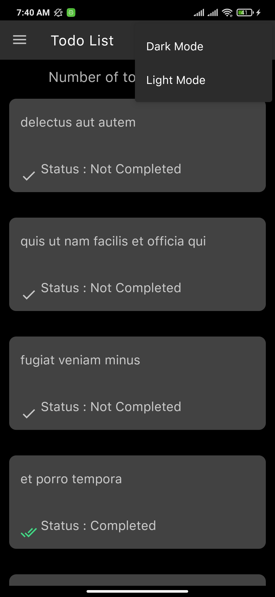
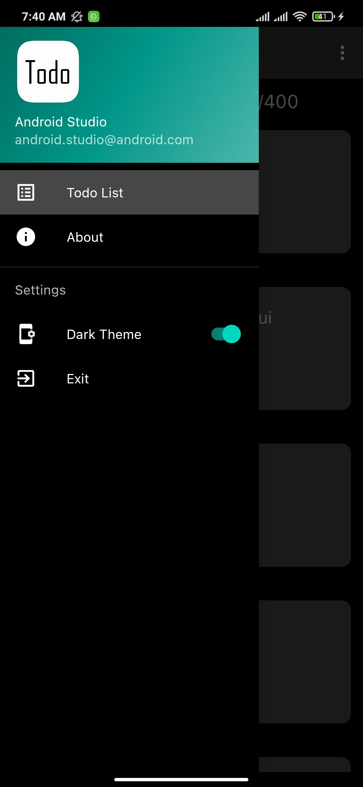
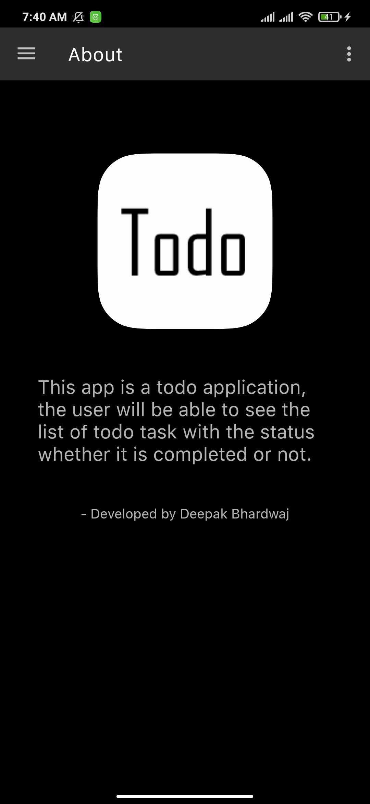

# ToDo List - Android

> This application makes it easy to display your task list on Android phones & tablets.

This app is a todo application, the user will be able to see the list of todo task with the status whether it is completed or not.

This application not requires a network connection to work.

  
  
  

## Features

- [x] Simple ToDo List (with status completed or not).
- [x] Dark theme with state save.
- [x] Shimmer effect for great USER EXPERIENCE.
- [x] Swipe down to refresh list.
- [x] Network error page.

## Requirements

- Android Studio 4.2.1
- Android 6.0+

## Usage

If you just want to install this application on your device, follow this instructions.

1. Download the .APK on this link :
   `https://github.com/WestFR/ToDoList-Android/tree/master/app-build-debug/app-debug.apk`

2. Install this .APK on your device

3. Enjoy and put a star !

## Installation (for developers)

1. Clone this project in your project folder : `git clone https://github.com/WestFR/ToDoList-Android`

2. Open this project thank your Android Studio and make one `Build Gradle Sync`

3. Enjoy (and develop your specific function)
